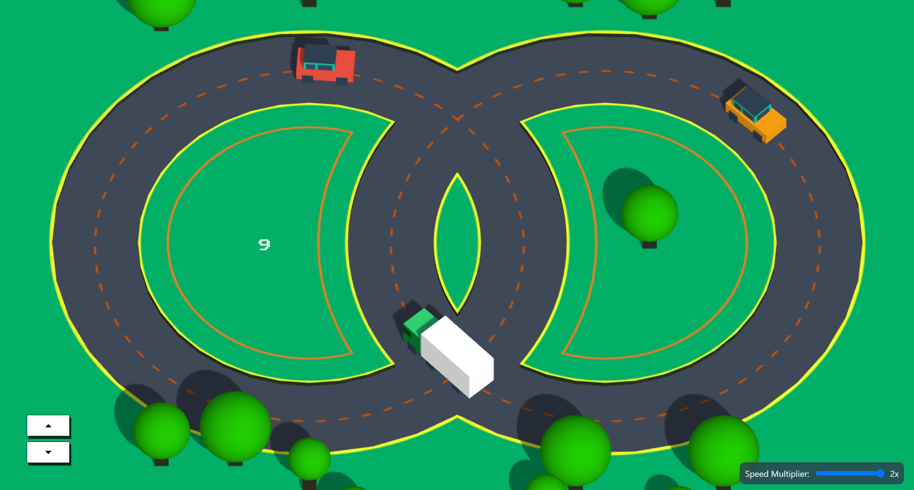

# 3D Car Survival Game

> car.dakshthapar.com

## Gameplay

In the 3D Car Survival Game, you drive a car on a circular track with increasing difficulty as more vehicles are added. The objective is to survive as long as possible without colliding with other vehicles.

- **Survive:** Avoid other vehicles on the track.
- **Score:** Your score increases with each lap you complete.

## Controls

- **Accelerate:** `Arrow Up` key or press the `Accelerate` button on the screen.
- **Decelerate:** `Arrow Down` key or press the `Decelerate` button on the screen.
- **Reset:** Press `R` to reset the game.

## Features

- **Responsive Design:** The game adjusts to different screen sizes.
- **Realistic Physics:** Car movements are simulated with realistic physics.
- **Dynamic Difficulty:** The game becomes more challenging as you progress, with more vehicles being added.
- **Customizable Settings:** Adjust the speed multiplier using the input slider.
